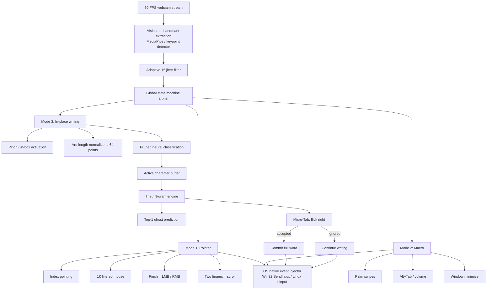
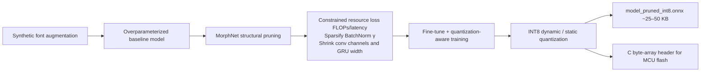

# Project Specification: In-Place AirTouch, Unistroke AI, and Ghost-Text Engine

> **How to read this file**
>
> - **Human:** start at [What this product is](#1-what-this-product-is), then [Hard budgets](#2-hard-budgets). Those two sections are the whole product in plain language.
> - **AI:** treat this document as the source of truth. Obey every numeric budget, tensor shape, file path, and module contract. Do not invent placeholders. If SKILL.md and this file disagree, **this file wins** for architecture, budgets, and file layout.

---

## 1. What this product is

An ultra-low-latency, zero-fatigue contactless PC controller. A standard webcam becomes two things at once:

| Mode | What the user does | What the PC does |
| --- | --- | --- |
| Spatial mouse and gestures | Point, pinch, swipe in the air | Cursor, click, scroll, window management |
| In-place unistroke airwriting | Tiny finger strokes inside a **5 cm × 5 cm** box (elbow on desk) | Letters, numbers, macros |
| Ghost-text autocomplete | Keep writing; flick right (micro-Tab) to accept | Trie + N-gram fills the rest of the word |

**Speed target:** 70–95 WPM without intrusive auto-replacement.

**Why MorphNet is in the product:** before the model is quantized, MorphNet-style structural pruning (L1 on BatchNorm scale parameters γ) automatically deletes unused conv channels and GRU hidden units so the runtime stays inside the latency and memory caps.

---

## 2. Hard budgets

These numbers are non-negotiable for the PC daemon.

| Budget | Limit | Split |
| --- | --- | --- |
| Total RAM | **≤ 200 MB** | Vision ~140 MB, pruned model ≤ 10 MB, Trie dictionaries ~25 MB, core ~10 MB |
| Character classification | **≤ 1 ms** | Pruned model, CPU |
| Autocomplete lookup | **≤ 0.3 ms** | Memory-mapped Trie |
| End-to-end latency | **≤ 15 ms** | At 60 FPS capture |

**Embedded portability target** (same models, smaller silicon):

- ESP32-S3 with **< 8 MB PSRAM**
- Luckfox RV1106 micro-SoC

---

## 3. Technical stack

| Layer | Stack |
| --- | --- |
| Training and data | Python 3.10+, PyTorch, NumPy, FontTools / FreeType, `torch-pruning` |
| Model optimization | MorphNet / structured pruning + INT8 (post-training and QAT) |
| Runtime daemon | C++17/20, CMake 3.20+, OpenCV 4.x, ONNX Runtime (or TFLite Micro), MediaPipe Hands |
| Autocompletion | Custom C++ memory-mapped Trie + N-gram language model (**RU, EN, HE**) |

---

## 4. Runtime architecture

Webcam in → landmarks → jitter filter → one state machine → three modes → OS events out.



### Mode cheat-sheet

| Mode | Activation | Behavior |
| --- | --- | --- |
| Pointer | Index pointing | Smooth cursor; pinch = left/right click; two fingers = scroll |
| Macro | Palm swipes | Alt+Tab, volume, window minimize |
| Writing | Pinch / in-box | Strokes inside the 5 cm box → character → ghost text → optional flick-right accept |

---

## 5. Offline ML optimization pipeline

This does **not** run on the daemon. It runs once on GPU, then exports a tiny INT8 model.



---

## 6. Repository file structure

```text
airwriting-ai/
├── .cursorrules                        # Context injection and architectural rules for Cursor AI
├── CMakeLists.txt                      # Root C++ build configuration
├── README.md                           # Build, dependencies, how to run
├── requirements.txt                    # Python deps for ML and synthetic pipeline
├── SKILL.md                            # Agent persona and engineering rules
├── PROJECT_SPECIFICATION.md            # This file
│
├── configs/
│   ├── app_config.json                 # Runtime thresholds, camera index, filter cutoffs
│   ├── gestures_def.json               # Pointer / macro gesture threshold mappings
│   ├── unistroke_map.json              # Unistroke character and macro definitions
│   └── pruning_config.json             # MorphNet targets (FLOPs budget, gamma penalties)
│
├── data/
│   ├── dictionaries/                   # Word-frequency lists for autocomplete
│   │   ├── en_freq.txt
│   │   ├── ru_freq.txt
│   │   └── he_freq.txt
│   ├── fonts/                          # Raw TTF fonts for synthetic stroke extraction
│   │   ├── latin/
│   │   ├── cyrillic/
│   │   └── hebrew/
│   └── synthetic/                      # Generated vector datasets (.npy / .parquet)
│
├── ml_pipeline/                        # Python: data, train, prune, export
│   ├── __init__.py
│   ├── font_sampler.py                 # Continuous vector strokes from TTF glyphs
│   ├── augmentor.py                    # Kinematic distortions (shear, velocity, noise, tremor)
│   ├── dataset.py                      # PyTorch Dataset for normalized stroke sequences
│   ├── model.py                        # Parametric 1D-CNN + BiGRU + Attention
│   ├── train.py                        # Baseline GPU training
│   ├── morphnet_pruner.py              # Iterative structured pruning and channel shrinking
│   ├── export_onnx.py                  # ONNX export, INT8 static/dynamic quantization
│   └── evaluate.py                     # Accuracy, FLOPs, latency benchmarks
│
├── src/                                # C++ runtime daemon
│   ├── main.cpp                        # Entry, threads, signal handling
│   ├── core/
│   │   ├── config.hpp                  # Config loader and runtime parameters
│   │   ├── ring_buffer.hpp             # Zero-allocation circular coordinate buffer
│   │   └── types.hpp                   # Vector2f, Point3f, StateEnums, GestureEvent
│   ├── vision/
│   │   ├── camera_stream.hpp/.cpp      # Threaded high-FPS capture
│   │   ├── hand_tracker.hpp/.cpp       # Landmark extraction wrapper
│   │   └── one_euro_filter.hpp/.cpp    # Adaptive 1€ jitter filter
│   ├── recognition/
│   │   ├── preprocessor.hpp/.cpp       # Arc-length resampler and 4-feature tensor
│   │   ├── onnx_engine.hpp/.cpp        # ONNX Runtime inference (CPU)
│   │   └── state_machine.hpp/.cpp      # Pointer vs Macro vs Writing
│   ├── autocompletion/
│   │   ├── trie_node.hpp               # Cache-friendly Trie node layout
│   │   ├── trie_engine.hpp/.cpp        # Prefix tree loader and top-k matcher
│   │   └── ghost_text_manager.hpp/.cpp # Active prefix + Tab-gesture commit
│   └── platform/
│       ├── input_injector.hpp          # Abstract OS input synthesis
│       ├── input_injector_win.cpp      # Windows SendInput
│       └── input_injector_linux.cpp    # Linux uinput / X11
│
├── tests/
│   ├── test_resampler.cpp              # Arc-length trajectory normalization
│   ├── test_trie.cpp                   # Trie lookup correctness and benchmarks
│   ├── test_pruning_parity.py          # Accuracy delta: baseline vs pruned
│   └── test_onnx_inference.py          # Python vs C++ ONNX parity
│
└── deploy/
    ├── compile_to_c_array.py           # Pruned .onnx → C header byte array for MCUs
    └── esp32_firmware_stub/            # Minimal C++ stub for microcontroller deploy
```

**AI rule:** new code goes in the file listed above. Do not dump training logic into `src/`, and do not put the C++ daemon inside `ml_pipeline/`.

---

## 7. Module execution contracts

### 7.1 Kinematic preprocessor (`preprocessor.cpp`)

Turns a messy finger path into a fixed-size tensor the ONNX model can eat.

| Step | Action |
| --- | --- |
| Input | Raw points `P = {(x0, y0), …, (xN, yN)}` collected inside the 5 cm × 5 cm virtual box |
| 1 | 3-point moving average (kill sensor jitter) |
| 2 | Arc-length parameterization to **exactly 64** equidistant points |
| 3 | Translate centroid to `(0, 0)` and scale-normalize to `[-1.0, 1.0]` |
| 4 | Build feature matrix of shape **`(1, 63, 4)`**: `[Δx, Δy, sin(θ), cos(θ)]` |
| Output | Flat float array, ready for **zero-copy** ONNX tensor inference |

**Why 63, not 64:** 64 points produce 63 consecutive deltas. That is the sequence the 1D-CNN / BiGRU sees.

### 7.2 MorphNet pruning (`morphnet_pruner.py`)

Shrinks the overparameterized baseline until it fits MCU flash.

**Total loss:**

```text
L_total = L_CrossEntropy + λ_resource * Σ_l Cost(l) * |γ_l|
```

- `γ_l` = BatchNorm scale factors of 1D BN layers
- `Cost(l)` = FLOPs / latency contribution of layer `l`

| Stage | What happens |
| --- | --- |
| Channel shrinking | Channels with `|γ_l| < ε_threshold` are physically removed from the weight tensors |
| Fine-tuning | 5–10 epochs on the trimmed net, with learning-rate warmup |

**Compression targets:**

| Stage | Parameters | Size |
| --- | --- | --- |
| Baseline | ~65k | ~280 KB FP32 |
| Pruned | ~15k–22k | ~60–90 KB FP32 |
| Pruned + INT8 | — | **≤ 25 KB** (MCU RAM / flash) |

### 7.3 Autocompletion engine (`trie_engine.cpp`)

A multilingual prefix Trie loaded from pre-sorted frequency lexicons (EN, RU, HE).

| Event | Action |
| --- | --- |
| Character recognized | Append to `active_prefix` |
| Lookup | Top candidate by frequency / N-gram score |
| Show | Emit as **passive** ghost text (not typed yet) |
| Tab micro-gesture: sharp right flick **< 40 ms** | Inject remaining suffix into OS input, append trailing space `' '`, reset `active_prefix`, clear ghost text |
| Next unistroke instead of Tab | Overwrite ghost text with the new prefix lookup |

Ghost text is never committed unless the user flicks. That is what keeps 70–95 WPM from becoming auto-correct fighting the writer.

---

## 8. Implementation roadmap

| Phase | Milestone | Key deliverable |
| --- | --- | --- |
| 1 | Data generation and baseline training | `font_sampler.py`, synthetic augmentor, PyTorch baseline |
| 2 | MorphNet pruning and INT8 quantization | `morphnet_pruner.py`, channel prune, fine-tune, `export_onnx.py` |
| 3 | Autocompletion core | C++ Trie, EN/RU/HE dictionaries, N-gram ranker |
| 4 | Vision and filtering | OpenCV / MediaPipe capture, 1€ filter, 5 cm micro-box tracker |
| 5 | FSM and system integration | Pointer vs Macro vs Writing, Tab-gesture handler, OS injector |
| 6 | Embedded port and verification | Latency profile, leak audit, C byte-array export for ESP32 / Luckfox |

Build in this order. Later phases depend on earlier artifacts (a pruned ONNX model, a Trie, then the FSM that glues them).

---

## 9. Glossary

| Term | Meaning |
| --- | --- |
| Unistroke | One continuous finger path = one character |
| Micro-box | Fixed 5 cm × 5 cm writing zone; elbow stays on the desk |
| 1€ filter | One-Euro filter: adaptive low-pass so the cursor is smooth without lag |
| Ghost text | Predicted word shown but not typed until micro-Tab |
| Micro-Tab | Sharp right flick under 40 ms that accepts ghost text |
| MorphNet | Pruning method that uses BatchNorm γ to drop unused channels |
| QAT | Quantization-aware training: train as if weights were INT8 |
| HID injection | Fake keyboard/mouse events at OS level (`SendInput` / `uinput`) |
     ## 7. Step-by-Step Execution Protocol (Agent Workflow)

When the user gives commands like "Выполни шаг 1" or "Переходи к шагу 2", execute strictly according to these atomic step definitions:

### [STEP 1] Data Generation & Font Parsing
* **Target Files:** `ml_pipeline/font_sampler.py`, `ml_pipeline/augmentor.py`, `ml_pipeline/dataset.py`
* **Task Contract:**
  1. Load system/bundled TTF fonts for Latin (A-Z, 0-9), Cyrillic (А-Я), and Hebrew.
  2. Extract continuous contour paths using `freetype-py` or `fonttools`.
  3. Resample each glyph contour to exactly 64 equidistant 2D points via cumulative arc-length.
  4. Generate synthetic kinematically distorted variations (shear, velocity changes, human hand tremor, random scale).
  5. Compute 4-feature vector per step: `[dx, dy, sin(theta), cos(theta)]` -> tensor shape `(63, 4)`.
* **Acceptance Criteria:** A runnable script that outputs `data/synthetic/synthetic_dataset.npz` and displays a matplotlib verification plot of 5 random characters.

---

### [STEP 2] Neural Architecture & Baseline Training
* **Target Files:** `ml_pipeline/model.py`, `ml_pipeline/train.py`, `ml_pipeline/evaluate.py`
* **Task Contract:**
  1. Implement PyTorch `1D-CNN + BiGRU + Temporal Attention` model (<70k parameters).
  2. Build training loop with AdamW, CrossEntropyLoss, and Cosine Annealing learning rate.
  3. Validate model convergence on synthetic test split (target: >98% top-1 accuracy).
* **Acceptance Criteria:** Model weights saved to `data/checkpoints/baseline_model.pth` with evaluation metrics logged in terminal.

---

### [STEP 3] MorphNet Structural Pruning & INT8 Export
* **Target Files:** `ml_pipeline/morphnet_pruner.py`, `ml_pipeline/export_onnx.py`
* **Task Contract:**
  1. Apply L1 regularization penalty to BatchNorm scaling factors ($\gamma$).
  2. Prune channels where $|\gamma| < \text{threshold}$ and rebuild compact network.
  3. Fine-tune pruned network for 5 epochs.
  4. Export to ONNX with Dynamic INT8 quantization (`model_pruned_int8.onnx`).
* **Acceptance Criteria:** Output file `model_pruned_int8.onnx` has size $\le 40\text{ KB}$ and top-1 accuracy drops by $< 0.5\%$.

---

### [STEP 4] Predictive Autocompletion Engine (C++)
* **Target Files:** `src/autocompletion/trie_node.hpp`, `src/autocompletion/trie_engine.hpp/.cpp`, `src/autocompletion/ghost_text_manager.hpp/.cpp`
* **Task Contract:**
  1. Build zero-allocation prefix Trie loaded from sorted word frequency dictionaries.
  2. Implement `lookup_top1(prefix)` with latency $< 0.3\text{ ms}$.
  3. Manage active prefix buffer and emit passive Ghost Text suggestion strings.
  4. Implement commit logic for Tab micro-gesture.
* **Acceptance Criteria:** `tests/test_trie.cpp` passes all benchmark assertions.

---

### [STEP 5] Vision Capture, Filter & 5x5cm Micro-Box
* **Target Files:** `src/vision/one_euro_filter.hpp/.cpp`, `src/vision/hand_tracker.hpp/.cpp`, `src/recognition/preprocessor.hpp/.cpp`
* **Task Contract:**
  1. Initialize camera capture and extract index finger tip landmarks.
  2. Apply adaptive $1€$ filter to coordinates for zero-jitter tracking.
  3. Anchor virtual $5\text{ cm} \times 5\text{ cm}$ interaction micro-box.
  4. Buffer trajectory points during gesture and normalize to 64 equidistant points on stroke release.
* **Acceptance Criteria:** Smooth real-time coordinate feed with zero jitter when still and sub-10ms response on fast flicks.

---

### [STEP 6] FSM Arbiter & OS Native Injection
* **Target Files:** `src/recognition/state_machine.hpp/.cpp`, `src/platform/input_injector_win.cpp`, `src/main.cpp`
* **Task Contract:**
  1. Implement FSM for mode switching: Pointer (1 finger), Gestures/Macros (palm), In-Place Writing (in-box).
  2. Detect Tab micro-gesture (sharp right flick $< 40\text{ ms}$).
  3. Inject text and mouse events directly into OS via Win32 `SendInput` / Linux `uinput`.
* **Acceptance Criteria:** Fully integrated executable running background loop under $200\text{ MB}$ RAM and $< 15\text{ ms}$ total latency.